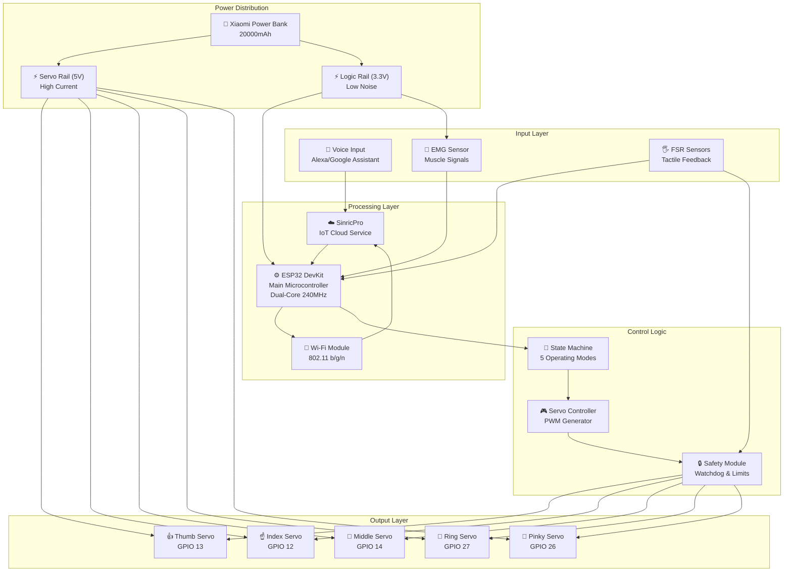
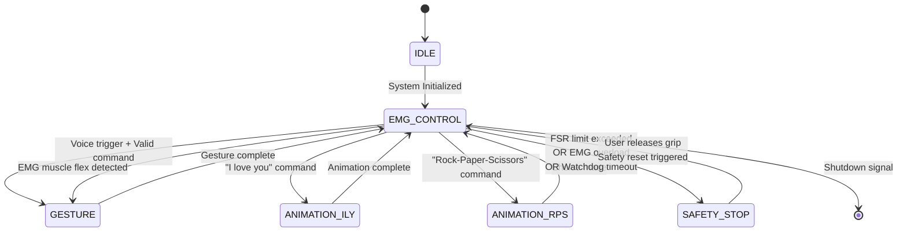
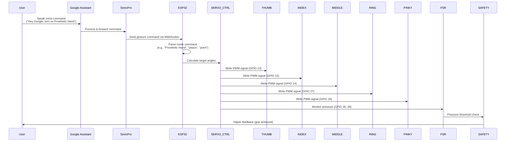
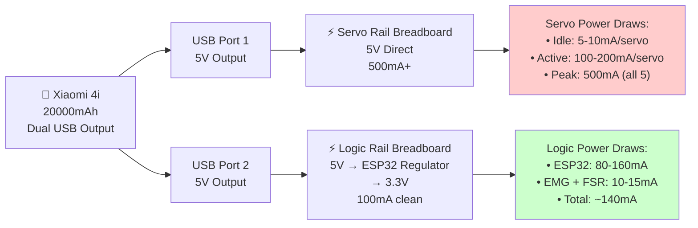

# 🤖 Krtrimahastah: AI-Powered Low-Cost Prosthetic Hand

[](https://opensource.org/licenses/MIT)
[]()

**Krtrimahastah** (Sanskrit for _Artificial Hand_) is an open-source, affordable, and intelligent prosthetic arm designed to bridge the gap between expensive bionic limbs and passive cosmetic devices.

By leveraging 3D printing, the ESP32 microcontroller, AI integration, and affordable hobbyist components, this project delivers a fully functional, multi-modal assistive device for under **$100 USD**.

🎥 **[Project Demo Video](https://youtu.be/BNZyQIecj14)**

---

## 📋 Table of Contents

- [Key Features](#-key-features)
- [Project Overview](#-project-overview)
- [Hardware Architecture](#-hardware-architecture)
- [System Architecture & Connection Flow](#-system-architecture--connection-flow)
- [3D Model Components](#-3d-model-components)
- [Wire Mapping](#-wire-mapping)
- [Electrical Schematic](#-electrical-schematic)
- [Control Logic](#-control-logic)
- [Software Setup](#-software-setup)
- [Installation & Setup](#-installation--setup)
- [Usage Guide](#-usage-guide)
- [File Structure](#-file-structure)
- [Contributing](#-contributing)
- [License](#-license)
- [Disclaimer](#-disclaimer)

---

## 🌟 Key Features

### 🎯 **Multi-Modal Control System**

- **Voice Commands (Primary):** Integrated with SinricPro IoT platform for natural language voice control via Alexa/Google Assistant
- **EMG Muscle Signals (Secondary):** Backup EMG-based control for silent/offline operation with binary toggle (Open ↔ Close)
- **Smart Home Integration:** Connect to Amazon Alexa or Google Home for hands-free gesture commands

### 🧠 **Intelligent Hardware**

- **Tendon-Driven Actuation:** Bio-inspired mechanical design with 5 independent MG90s servos for anthropomorphic finger movement
- **Haptic Feedback System:** Force Sensitive Resistors (FSRs) in fingertips enable closed-loop grip control, preventing crushing of delicate objects
- **Haptic Force Sensing:** Real-time pressure monitoring (max grip force: 2000 units with safety cutoff)

### ⚡ **Power Management Innovation**

- **All-Day Portability:** 20000mAh Xiaomi 4i power bank with optimized power splitting:
  - **High-Power Rail:** 5V for servo actuation (high current spikes)
  - **Logic Rail:** 3.3V via ESP32 regulator (low current, noise-isolated)

### 💰 **Cost-Effective Engineering**

- Built entirely with off-the-shelf hobbyist components
- FDM 3D printing for structural parts (PLA material)
- Total BOM cost under $100 USD
- Open-source firmware for transparency and community contribution

### 🔒 **Safety Features**

- Pressure/tactile feedback prevents over-gripping
- Software watchdog timer (10-second timeout)
- EMG debounce protection (200ms)
- Safety state machine for graceful error handling
- Servo angle constraints to prevent mechanical damage

---

## 🎯 Project Overview

### **Problem Statement**

Prosthetic limbs remain inaccessible to the majority due to prohibitive costs ($3,000-$100,000+). This project demonstrates that functional bionic devices can be built affordably using modern open-source hardware and AI.

### **Solution**

A modular, 3D-printed prosthetic hand that combines:

- **Affordable actuation:** MG90s servo motors instead of expensive linear actuators
- **Intelligent control:** AI-based natural language processing with offline fallback
- **Biological feedback:** FSR-based haptic sensing for dexterous manipulation
- **Energy efficiency:** Optimized power management for all-day wearability

---

## ⚙️ Hardware Architecture

### **Bill of Materials (BOM)**

| Component                     | Quantity | Function                                               |
| :---------------------------- | :------: | :----------------------------------------------------- |
| **ESP32 DevKit V1**           |    1     | Main microcontroller (32-bit dual-core, Wi-Fi/BLE)     |
| **MG90s Servo Motor**         |    5     | Individual finger actuators (180° range, 1.5kg torque) |
| **SinricPro Account**         |    1     | IoT cloud service for voice control integration        |
| **EMG Sensor Module V3.0**    |    1     | Muscle signal acquisition (3-channel, 10-bit ADC)      |
| **FSR402 Pressure Sensor**    |    2     | Tactile feedback in thumb & index finger               |
| **Breadboard & Jumper Wires** |    —     | Prototyping & connections                              |
| **3D Printed Parts**          |    —     | PLA chassis (hand, phalanges, forearm cover)           |
| **Servo Horns & Hardware**    |    —     | Servo linkages & fasteners                             |
| **USB-C Cable & Connectors**  |    —     | Power delivery & debugging                             |

---

## 🔌 Master Pinout Reference

### **ESP32 GPIO Pin Allocation**

| Component          | Signal Line   | ESP32 GPIO | Pin Type   | Notes                           |
| :----------------- | :------------ | :--------: | :--------- | :------------------------------ |
| **SERVO: Thumb**   | PWM Signal    |  GPIO 13   | OUTPUT     | Channel 0, PWM (0-180°)         |
| **SERVO: Index**   | PWM Signal    |  GPIO 12   | OUTPUT     | Channel 1, PWM (0-180°)         |
| **SERVO: Middle**  | PWM Signal    |  GPIO 14   | OUTPUT     | Channel 2, PWM (0-180°)         |
| **SERVO: Ring**    | PWM Signal    |  GPIO 27   | OUTPUT     | Channel 3, PWM (0-180°)         |
| **SERVO: Pinky**   | PWM Signal    |  GPIO 26   | OUTPUT     | Channel 4, PWM (0-180°)         |
| **EMG Sensor**     | Analog Output |  GPIO 34   | ADC1 INPUT | 0-4095 (0-3.3V) muscle signal   |
| **FSR: Thumb Tip** | Analog Output |  GPIO 36   | ADC1 INPUT | Pressure sensing (0-2000 units) |
| **FSR: Index Tip** | Analog Output |  GPIO 39   | ADC1 INPUT | Pressure sensing (0-2000 units) |

### **Servo Angle Limits**

| Finger | Min Angle (Open) | Max Angle (Closed) | Movement Range |
| :----- | :--------------: | :----------------: | :------------: |
| Thumb  |        0°        |        120°        |      120°      |
| Index  |        0°        |        175°        |      175°      |
| Middle |        0°        |        175°        |      175°      |
| Ring   |        0°        |        175°        |      175°      |
| Pinky  |        0°        |        175°        |      175°      |

---

## 🏗️ System Architecture & Connection Flow

### **Overall System Architecture**



### **Control Flow & State Machine Diagram**



### **Data Flow: Voice Command Pipeline**



### **Power Management & Rail Isolation**



---

## 🖐️ 3D Model Components

### **Hand Assembly Structure**


_Reference: Complete hand assembly layout showing all finger components and palm structure_

The prosthetic hand consists of **10 3D-printed parts** designed for FDM printing (PLA material):

| Component           | File Name               | Purpose                                          | Print Time | Material  |
| :------------------ | :---------------------- | :----------------------------------------------- | :--------: | :-------: |
| **Hand Layout**     | `Hand Layout.stl`       | Main reference assembly drawing                  |     —      | Reference |
| **Palm/Metacarpal** | `Hand.stl`              | Central palm structure housing servo mounts      |  2-3 hrs   |    PLA    |
| **Thumb Digit**     | `Finger_Thumb.stl`      | Opposable thumb with servo horn slot             |   45 min   |    PLA    |
| **Index Finger**    | `Finger_Index.stl`      | Index finger phalanges & servo linkage           |    1 hr    |    PLA    |
| **Middle Finger**   | `Finger_Middle.stl`     | Middle finger phalanges & servo linkage          |    1 hr    |    PLA    |
| **Ring Finger**     | `Finger_Ring.stl`       | Ring finger phalanges & servo linkage            |    1 hr    |    PLA    |
| **Pinky Finger**    | `Finger_Pinky.stl`      | Pinky finger phalanges & servo linkage           |   45 min   |    PLA    |
| **Arm Cover**       | `Arm_Cover.stl`         | Protective forearm shell & electronics enclosure |  1-2 hrs   |    PLA    |
| **Print Layout 1**  | `Hand_print_layout.stl` | Optimized 2D nesting for print bed               |     —      | Reference |
| **Print Layout 2**  | `Right_Hand.stl`        | Mirror version (left/right compatibility)        |     —      | Reference |

### **3D Printing Recommendations**

```
Printer Settings:
├─ Nozzle Temperature: 210°C (PLA)
├─ Bed Temperature: 60°C
├─ Layer Height: 0.2mm (0.1mm for finger tips for detail)
├─ Infill: 20% (gyroid pattern for strength/weight ratio)
├─ Support: Yes (especially for finger undercuts)
├─ Print Speed: 50mm/s
├─ Total Print Time: ~8-10 hours
└─ Material Weight: ~250g PLA filament
```

### **Assembly Instructions**

1. Print all components with support structures
2. Remove supports carefully (palm/finger joints are delicate)
3. Use M3 bolts & nuts to attach servos to palm housing
4. Connect servo horns to finger linkages via push-fit connectors
5. Assemble fingers and attach to palm pivot points
6. Mount arm cover shell with servo motor peeking through rear cavity
7. Route wiring through forearm tube to electronics enclosure
8. Perform mechanical range-of-motion test before powering

---

## 🔗 Wire Mapping

### **Connection Matrix: Sensors ↔ ESP32**

**Detailed wiring documentation available in:** [hardware/wiring/Wire Mapping for the Development of a Low-Cost Prosthetic Hand (1).xlsx](hardware/wiring/Wire%20Mapping%20for%20the%20Development%20of%20a%20Low-Cost%20Prosthetic%20Hand%20%281%29.xlsx)

### **Quick Wire Reference (5V Servos)**

```
┌─────────────────────────────────────────────────────────────┐
│                    SERVO CONNECTIONS                         │
├──────────────┬──────────┬──────────┬──────────────────────────┤
│ Servo Motor  │ Color    │ ESP32    │ Function                 │
├──────────────┼──────────┼──────────┼──────────────────────────┤
│ Thumb        │ Orange   │ GPIO 13  │ PWM Output (1500µs mid)  │
│ Index        │ Yellow   │ GPIO 12  │ PWM Output (1500µs mid)  │
│ Middle       │ Green    │ GPIO 14  │ PWM Output (1500µs mid)  │
│ Ring         │ Blue     │ GPIO 27  │ PWM Output (1500µs mid)  │
│ Pinky        │ Purple   │ GPIO 26  │ PWM Output (1500µs mid)  │
│ GND (All)    │ Black    │ GND      │ Common ground            │
│ +5V (All)    │ Red      │ +5V Rail │ Servo power rail         │
└──────────────┴──────────┴──────────┴──────────────────────────┘
```

### **Sensor Wire Connections**

```
┌─────────────────────────────────────────────────────────────┐
│              SENSOR & INPUT CONNECTIONS                     │
├──────────────────┬──────────┬──────────┬────────────────────┤
│ Component        │ Signal   │ ESP32    │ Type               │
├──────────────────┼──────────┼──────────┼────────────────────┤
│ EMG Sensor       │ SIG      │ GPIO 34  │ Analog Input (ADC) │
│ FSR Thumb        │ SIG      │ GPIO 36  │ Analog Input (ADC) │
│ FSR Index        │ SIG      │ GPIO 39  │ Analog Input (ADC) │
│ All Sensors      │ GND      │ GND      │ Common ground      │
│ All Sensors      │ +3.3V    │ 3.3V    │ Logic power        │
└──────────────────┴──────────┴──────────┴────────────────────┘
```

### **SinricPro Voice Integration**

```
Alexa/Google Assistant → SinricPro Cloud → WebSocket → ESP32
│
├─ Supported Gestures: 20+ hand poses
├─ Protocol: WebSocket (persistent connection)
├─ Commands: Natural language ("open hand", "make a fist", "point")
├─ Response Time: ~200-500ms (cloud processing)
└─ Offline Fallback: EMG sensor toggle control
```

---

## 📊 Electrical Schematic

### **High-Level Block Diagram**

**Schematic file:** [hardware/schematics/Prosthetci Hand Schematic.png](hardware/schematics/Prosthetci%20Hand%20Schematic.png)

```
┌──────────────────────────────────────────────────────────────────┐
│                    POWER DISTRIBUTION SYSTEM                      │
├──────────────────────────────────────────────────────────────────┤
│                                                                   │
│  Xiaomi Power Bank 4i (20000mAh, Dual Output)                    │
│  ├─ USB Port 1 (5V, 1A) ──► SERVO POWER RAIL (5V, 500mA+)       │
│  │                         ├─► MG90s Servo 1 (GPIO 13)           │
│  │                         ├─► MG90s Servo 2 (GPIO 12)           │
│  │                         ├─► MG90s Servo 3 (GPIO 14)           │
│  │                         ├─► MG90s Servo 4 (GPIO 27)           │
│  │                         └─► MG90s Servo 5 (GPIO 26)           │
│  │                                                                │
│  └─ USB Port 2 (5V, 1A) ──► LOGIC POWER RAIL (3.3V via ESP32)   │
│                             ├─ ESP32 DevKit (Voltage Regulator)  │
│                             │  ├─ Wi-Fi Module (SinricPro)       │
│                             │  ├─ EMG Sensor V3.0                │
│                             │  └─ FSR402 Sensors (×2)            │
│                                                                   │
└──────────────────────────────────────────────────────────────────┘
```

### **Voltage Levels & Current Budget**

```
┌────────────────────────────────────────────────────────┐
│            POWER CONSUMPTION ANALYSIS                  │
├────────────────────────────────────────────────────────┤
│                                                        │
│ SERVO RAIL (5V):                                       │
│  • Idle (all open):        25-50mA    (~250mW)       │
│  • Single servo active:   100-150mA   (~750mW)       │
│  • All servos moving:     400-600mA   (~3W)          │
│  • Peak grip (all tight):  600-800mA  (~4W)          │
│                                                        │
│ LOGIC RAIL (3.3V @ ESP32):                            │
│  • ESP32 idle:             80-100mA                   │
│  • Wi-Fi active:          150-200mA (peak)           │
│  • EMG + FSR Sensors:      10-15mA                    │
│  • Total logic:            140-220mA                  │
│                                                        │
│ BATTERY RUNTIME (Estimated):                          │
│  • Idle (servos open):     ~100 hours                 │
│  • Mixed use (50% active): ~12-15 hours              │
│  • Heavy use (all moving): ~5-7 hours                 │
│                                                        │
└────────────────────────────────────────────────────────┘
```

---

## ⚙️ Control Logic

### **Operating Modes**

#### **Mode 1: EMG Toggle Control (Offline)**

- **Activation:** Muscle flex detected by EMG sensor
- **Logic:** Binary toggle (Open ↔ Close)
- **Use Case:** Rapid, frequent actions; no voice needed
- **Reliability:** High (no network dependency)

```
EMG Signal → Threshold Detection → Debounce (200ms)
  → State Toggle → Servo Movement → 2-3s Animation → Return to Idle
```

#### **Mode 2: Voice Command Control (Online)**

- **Activation:** Voice command via Alexa or Google Assistant
- **Processing Pipeline:**
  1. User speaks to Google Assistant: "Hey Google, turn on Prosthetic Hand" or "Hey Google, set hand to Peace mode"
  2. SinricPro cloud processes command via WebSocket
  3. ESP32 receives gesture mode string (e.g., "fist", "peace", "point")
  4. Execute corresponding servo movement pattern
- **Supported Commands:** 20+ gestures including "Prosthetic Hand," "Point," "Peace," "Hook," "Pinch," "Thumbs Up," "OK," "Love," "Gun," "Rock n Roll," "I Love You," "Rock Paper Scissors"

#### **Mode 3: Closed-Loop Grip**

- **Purpose:** Prevent over-gripping & crushing delicate objects
- **Implementation:**
  - FSR sensors in fingertips detect force
  - Once force exceeds threshold (2000 units), grip stops tightening
  - Maintains constant pressure automatically

#### **Mode 4: Custom Animations**

- **I Love You:** Sequential finger extension with timing
- **Rock-Paper-Scissors:** Randomized hand shape selection

#### **Mode 5: Safety Shutdown**

- **Triggers:**
  - FSR overload (detected crush force)
  - EMG sensor saturation (noise/interference)
  - Watchdog timer expiration (10 seconds)
- **Action:** Immediately open hand to safe position; log error to serial

---

## 💻 Software Setup

### **Prerequisites**

- **Arduino IDE** v1.8.19+ ([Download](https://www.arduino.cc/en/software))
- **ESP32 Board Support** installed via Board Manager
- **SinricPro Account** (Free) - Create at [https://sinric.pro](https://sinric.pro)
- **Amazon Alexa or Google Home** device (or mobile app)
- **Wi-Fi Network** with 2.4GHz support (5GHz not recommended for ESP32)

### **Required Libraries**

Install via Arduino Library Manager (`Sketch → Include Library → Manage Libraries`):

| Library       | Author           | Purpose                                 |
| :------------ | :--------------- | :-------------------------------------- |
| `ESP32Servo`  | Kevin Harrington | PWM servo control for MG90s motors      |
| `SinricPro`   | Boris Jaeger     | IoT cloud integration for voice control |
| `WebSockets`  | Markus Sattler   | WebSocket communication with SinricPro  |
| `ArduinoJson` | Benoit Blanchon  | JSON parsing for SinricPro messages     |

### **SinricPro Setup**

1. Create a free account at [https://sinric.pro](https://sinric.pro)
2. Create a new **Smart Home Device** → Select "Custom" type
3. Note your credentials:
   - **APP_KEY** - Found in "Credentials" section
   - **APP_SECRET** - Found in "Credentials" section
   - **DEVICE_ID** - Found in your device settings
4. Link SinricPro to **Amazon Alexa** or **Google Home**:
   - Open Alexa/Google Home app
   - Search for "SinricPro" skill and enable
   - Discover devices
5. Add credentials to firmware configuration

---

## 🚀 Installation & Setup

### **Step 1: Prepare Hardware**

```bash
1. Assemble 3D-printed hand structure (see 3D Model Components)
2. Mount 5 MG90s servos inside palm housing
3. Attach servo horns to finger linkages
4. Solder power supply rails on breadboard (5V servo, 3.3V logic)
5. Wire all components according to Master Pinout (see Wire Mapping section)
6. Mount ESP32 DevKit inside arm cover
7. Connect Xiaomi power bank via USB cables
8. Perform visual inspection for short circuits
```

### **Step 2: Prepare Firmware**

```bash
# Clone the repository
git clone https://github.com/harshitt13/Krtrimahastah.git
cd Krtrimahastah

# Open Arduino IDE
1. File → Open → firmware/prosthetic_hand_improved.ino
2. Board: ESP32 Dev Module
3. Port: COM3 (or your ESP32 port)
4. Upload Speed: 115200
```

### **Step 3: Configure Credentials**

Edit [firmware/prosthetic_hand_improved.ino](firmware/prosthetic_hand_improved.ino) and update:

```cpp
#define WIFI_SSID         "Your_Wi-Fi_SSID"
#define WIFI_PASS         "Your_Wi-Fi_Password"

#define APP_KEY           "YOUR_APP_KEY"      // From SinricPro Dashboard
#define APP_SECRET        "YOUR_APP_SECRET"  // From SinricPro Dashboard
#define DEVICE_ID         "YOUR_DEVICE_ID"          // From your SinricPro device
```

### **Step 4: Upload & Test**

```
1. Verify code (Sketch → Verify)
2. Upload to ESP32 (Sketch → Upload)
3. Open Serial Monitor (Tools → Serial Monitor, 115200 baud)
4. Press Reset button on ESP32
5. Observe startup messages and Wi-Fi connection
6. Say "Hey Google, discover devices" to find your prosthetic hand
7. Test voice commands: "Hey Google, turn on Prosthetic Hand"
8. Test EMG mode by flexing muscles
9. Verify all 5 fingers move smoothly
```

### **Step 5: Calibration**

```cpp
EMG Sensor Tuning:
├─ Flex muscle & note ADC reading
├─ Set EMG_OPEN_THR to 1/2 of reading
└─ Set EMG_CLOSE_THR to 3/4 of reading

FSR Sensor Tuning:
├─ Press fingertip & note ADC reading
├─ Set FSR_LIMIT to safe threshold (default 2000)
└─ Test grip on soft object to verify cutoff

Servo Angle Tuning:
├─ Adjust MAX_TP (thumb & pinky angle) for comfort
├─ Adjust MAX_OTHERS (index, middle, ring finger angle) for dexterity
└─ Test all gestures for smooth motion
```

---

## 📖 Usage Guide

### **Voice Control (via Alexa/Google Assistant)**

```
1. Say "Hey Google, turn on Prosthetic Hand" or "Hey Google, set hand to Peace mode"
2. SinricPro processes command and sends to ESP32
3. Hand executes the gesture smoothly
4. Stays in gesture until new command or EMG override

Supported Hey Google Commands:

Functional Gestures:
├─ "Hey Google, turn on Prosthetic Hand" or "Grab" or "Close"  → Full grip
├─ "Hey Google, set mode to Hook"                   → Hook grip (all fingers except thumb)
├─ "Hey Google, set mode to Pinch"                  → Precision pinch (thumb + index/middle)
├─ "Hey Google, set mode to Tripod"                 → Tripod grip (3 fingers)

Social Gestures:
├─ "Hey Google, turn on Open" or "Five" or "Paper"  → All fingers extended
├─ "Hey Google, set mode to Point" or "One"         → Index finger pointing
├─ "Hey Google, set mode to Peace" or "Two"         → Peace sign (index + middle)
├─ "Hey Google, set mode to Three"                  → Three fingers up
├─ "Hey Google, set mode to Four"                   → Four fingers up
├─ "Hey Google, set mode to Thumbs Up" or "Like"    → Thumbs up gesture
├─ "Hey Google, set mode to OK"                     → OK sign (thumb + index circle)
├─ "Hey Google, set mode to Love"                   → ILY sign (index + pinky)
├─ "Hey Google, set mode to Gun"                    → Finger gun
├─ "Hey Google, set mode to Rock and Roll"          → Rock hand sign
├─ "Hey Google, set mode to Call"                   → Call me gesture
├─ "Hey Google, set mode to Pinky"                  → Pinky promise

Animations:
├─ "Hey Google, set mode to I Love You"             → I-L-Y animation sequence
└─ "Hey Google, set mode to Rock Paper Scissors"    → Random RPS choice

Control:
├─ "Hey Google, turn on Hand"                       → Enable EMG control
└─ "Hey Google, turn off Hand"                      → Disable EMG control
```

### **EMG Control**

```
1. Ensure EMG sensor strap is worn around forearm
2. Relax arm at rest
3. Flex muscle briefly (1-2 second contraction)
4. Hand gesture toggles (Open ↔ Close)
5. No voice required; works offline

Gesture Sequence:
├─ Open → Flex → Close (1.5s animation)
├─ Close → Flex → Open (1.5s animation)
└─ Debounce: 200ms (ignores multiple quick flexes)
```

### **Emergency Stop**

```
Safety is automatic via FSR sensors:
→ If FSR detects force > 2000 units, hand opens automatically
→ Triggers SAFETY_STOP state
→ All fingers open slowly to safe position

Manual Reset:
→ Send "Open" command via Hey Google
→ Or use EMG sensor to toggle open
```

---

## 📁 File Structure

```
Krtrimahastah/
├── README.md                                    # Project documentation
├── LICENSE                                      # MIT License
│
├── firmware/
│   └── src.ino            # Main ESP32 firmware (682 lines)
│
└── hardware/
    ├── 3d-models/
    │   ├── Hand Layout.stl                     # Full assembly reference
    │   ├── Hand.stl                            # Palm structure
    │   ├── Finger_Thumb.stl                    # Thumb digit
    │   ├── Finger_Index.stl                    # Index finger
    │   ├── Finger_Middle.stl                   # Middle finger
    │   ├── Finger_Ring.stl                     # Ring finger
    │   ├── Finger_Pinky.stl                    # Pinky finger
    │   ├── Arm_Cover.stl                       # Forearm enclosure
    │   ├── Hand_print_layout.stl               # Print nesting guide
    │   └── Right_Hand.stl                      # Mirror version
    │
    ├── schematics/
    │   └── Prosthetci Hand Schematic.png       # Circuit diagram
    │
    └── wiring/
        └── Wire Mapping for the Development of a Low-Cost Prosthetic Hand.xlsx
            # Detailed pinout & connection matrix

```

---

## 🎓 Learning Resources

- **ESP32 Documentation:** [https://docs.espressif.com/projects/esp-idf/](https://docs.espressif.com/projects/esp-idf/)
- **SinricPro Documentation:** [https://sinricpro.github.io/esp8266-esp32-sdk/](https://sinricpro.github.io/esp8266-esp32-sdk/)
- **Servo Motor Control:** [https://randomnerdtutorials.com/esp32-servo-motor/](https://randomnerdtutorials.com/esp32-servo-motor/)
- **Myoware Muscle Sensor User-Manual** [https://robu.in/wp-content/uploads/2019/02/Muscle-Sensor-v3-Users-Manual.pdf/](https://robu.in/wp-content/uploads/2019/02/Muscle-Sensor-v3-Users-Manual.pdf)

---

## 📜 License

This project is licensed under the **MIT License** - see the [LICENSE](LICENSE) file for details.

Permission is granted for personal, educational, and commercial use with proper attribution.

---

## ⚠️ Disclaimer & Safety Notice

**IMPORTANT:** This is a **research prototype** and **NOT a medically certified device**.

### **Usage Warnings:**

- ⚠️ Not intended for medical/therapeutic use without proper regulatory approval
- ⚠️ Strength and safety capabilities vary widely based on component quality and assembly accuracy
- ⚠️ Do not use with high-pressure/high-risk gripping tasks
- ⚠️ Servo motors can pinch fingers; always supervise use around children
- ⚠️ Battery may overheat if damaged; inspect regularly for swelling
- ⚠️ Wi-Fi connectivity may drop; EMG control serves as offline backup
- ⚠️ Test all safety features before extended use

### **Liability:**

The author and contributors assume **NO LIABILITY** for injuries, property damage, or adverse outcomes resulting from the use or misuse of this device.

---

## 📞 Contact & Support

- **GitHub Issues:** [Report bugs or request features](https://github.com/harshitt13/Krtrimahastah/issues)
- **Email:** find.harshitkushwaha@gmail.com

---

_Making prosthetics affordable, intelligent, and accessible to all._ 🤖
